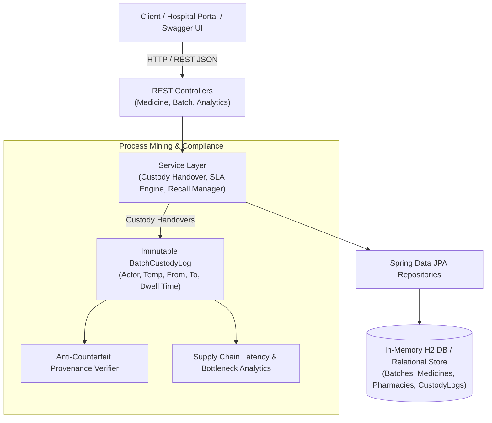

# 💊 MediMate — Enterprise Medicine Supply Chain & Custody Engine

[](https://www.oracle.com/java/)
[](https://spring.io/projects/spring-boot)
[](https://hibernate.org/)
[-yellow.svg)](https://www.h2database.com/)
[](LICENSE)

> A mission-critical pharmaceutical supply chain backend engineered to orchestrate drug batch custody transfers, enforce cold-chain temperature SLAs, verify anti-counterfeit batch provenance, and provide process mining latency analytics for hospital and distribution networks.

---

## 🎯 The Real-World Problem: Pharmaceutical Supply Chain Integrity

According to the World Health Organization (WHO), counterfeit and degraded medicines cause hundreds of thousands of preventable deaths and cost over $30 billion annually.

### Core Supply Chain Vulnerabilities:
1. **Counterfeit Infiltration**: Lack of end-to-end provenance verification allows counterfeit or diverted drugs into hospital pharmacies.
2. **Cold-Chain Excursions & Spoilage**: Vaccines, biologics, and insulin degrade rapidly if transit temperatures deviate from safe ranges (e.g. 2°C–8°C), yet conventional systems lack automated SLA breach detection.
3. **Delayed Regulatory Recalls**: When a batch defect or contamination is reported, legacy paper records delay quarantine, leaving compromised medications in circulation.

**MediMate** solves these problems using a state machine-driven workflow with real-time temperature telemetry, an immutable event audit trail, and instant anti-counterfeit verification.

---

## 🏛️ System Architecture



### Architectural Principles:
* **Clean Layered Separation**: Controllers, Services, Repositories, Entities, and DTOs.
* **Data Consistency & Auditing**: Immutable audit records for every custody transfer to comply with FDA 21 CFR Part 11 and DSCSA guidelines.
* **Transactional Reliability**: `@Transactional` boundaries protecting inventory allocation and emergency recalls.

---

## ⚙️ Batch Custody Lifecycle State Machine

Every pharmaceutical batch traverses an unbroken custody chain:

```
[MANUFACTURED] ──> [QUALITY_TESTED] ──> [CENTRAL_DEPOT] ──> [IN_TRANSIT] ──> [DELIVERED_TO_PHARMACY] ──> [DISPENSED]
       │                    │                  │                 │                    │
       └────────────────────┴──────────────────┴─────────────────┴────────────────────┴───> [RECALLED]
                                               │                 │                    │
                                               └──> [QUARANTINED]<────────────────────┘
```

---

## 🚀 Key Features

* **🛡️ Anti-Counterfeit Batch Verification (`GET /api/batches/{batchNumber}/verify`)**: Inspects complete historical custody transitions to verify drug authenticity and flag broken custody links.
* **❄️ Cold-Chain & Transit SLA Bottleneck Detection (`GET /api/analytics/stalled-shipments`)**: Flags shipments experiencing temperature excursions or transit delays past configured SLAs.
* **🚨 Emergency Batch Recall & Quarantine (`POST /api/batches/{id}/recall`)**: Instantly quarantines compromised batches across distribution nodes and appends a regulatory recall audit log.
* **⏳ Expiry Risk Alerting (`GET /api/analytics/expiring-batches`)**: Proactively identifies batches nearing expiration to prevent inventory write-offs.
* **📊 Process Mining Latency Analytics (`GET /api/analytics/latency`)**: Aggregates average and max dwell time across manufacturing, QC, warehousing, and transit stages.
* **📑 Interactive Swagger UI / OpenAPI 3**: Visual browser documentation to test all endpoints with 1 click.

---

## 🛠️ Tech Stack & Prerequisites

* **Language**: Java 11 (or higher)
* **Framework**: Spring Boot 2.7.18
* **Persistence**: Spring Data JPA, Hibernate ORM
* **Database**: H2 In-Memory Database (zero external configuration required)
* **API Documentation**: SpringDoc OpenAPI / Swagger 3
* **Build Tool**: Apache Maven (via included `./mvnw` wrapper)

---

## 🚦 Quickstart & Local Setup

### 1. Clone the Repository
```bash
git clone https://github.com/aanshiomar31-oss/medimate.git
cd medimate
```

### 2. Run the Application
```bash
./mvnw spring-boot:run
```

Once started, explore the application:
* 🌐 **Interactive Web Dashboard**: **[http://localhost:8080/](http://localhost:8080/)**
* 📑 **Interactive Swagger UI**: **[http://localhost:8080/swagger-ui.html](http://localhost:8080/swagger-ui.html)**
* 🗄️ **H2 In-Memory Database Console**: **[http://localhost:8080/h2-console](http://localhost:8080/h2-console)** (JDBC URL: `jdbc:h2:mem:medimatedb`, User: `sa`, Password: empty)

### 3. Interactive Web Dashboard Features
The application embeds a responsive dark-mode pharmaceutical monitoring dashboard:
* **Live KPI Counters**: Instant visual telemetry on active batches, active shipments, stalled transit items, compliance rates, and recalls.
* **Anti-Counterfeit Batch Provenance Verifier**: Search any batch number (e.g. `MED-2026-PF01`, `MED-2026-CV02`, `MED-2026-LP04`) to inspect unbroken custody logs, custodian digital signatures, location trace, and cold-chain compliance.
* **Real-time Cold-Chain Telemetry**: Live overview of all active inventory batches with temperature thresholds and storage status.
* **Process Mining & Latency Heatmap**: Celonis-style breakdown of average and maximum stage dwell times to isolate distribution bottlenecks.
* **Custody Handover & Regulatory Recall Controls**: In-browser forms to transfer batch custody or execute emergency FDA/CDSCO recalls.

---

## 📡 REST API Reference

### 1. Batch Custody & Anti-Counterfeit Verification
| Method | Endpoint | Description |
| :--- | :--- | :--- |
| `POST` | `/api/batches` | Register a newly manufactured medicine batch |
| `GET` | `/api/batches` | List batches (filters: `status`, `activeOnly`) |
| `GET` | `/api/batches/{id}` | Get batch details by ID |
| `POST` | `/api/batches/{id}/transfer` | Transfer custody with temperature logging & state validation |
| `POST` | `/api/batches/{id}/recall` | Trigger emergency regulatory recall & quarantine |
| `GET` | `/api/batches/{batchNumber}/verify` | Verify batch authenticity and inspect unbroken provenance chain |

### 2. Supply Chain Process Analytics
| Method | Endpoint | Description |
| :--- | :--- | :--- |
| `GET` | `/api/analytics/stalled-shipments` | Detect active shipments breaching transit SLAs or temperature limits |
| `GET` | `/api/analytics/expiring-batches` | List batches approaching expiration date |
| `GET` | `/api/analytics/latency` | Process mining stage latency and throughput metrics |
| `GET` | `/api/analytics/dashboard` | Executive KPI health summary of the distribution network |

### 3. Medicine & Partner Registry
| Method | Endpoint | Description |
| :--- | :--- | :--- |
| `GET` | `/api/medicines` | List catalog medicines (filter: `category`, `coldChainOnly`) |
| `POST` | `/api/medicines` | Register a new pharmaceutical drug |
| `GET` | `/api/manufacturers` | List licensed pharmaceutical manufacturers |
| `GET` | `/api/pharmacies` | List licensed receiving hospital/retail pharmacies |

---

## 🧪 Running Automated Tests

Run the full suite of unit and integration tests:
```bash
./mvnw test
```

Test coverage includes:
* `BatchStatusTest`: Pharmaceutical state machine rules, illegal jump rejection, and recall constraints.
* `MediMateServiceIntegrationTest`: End-to-end batch registration, custody handover, temperature violation checks, anti-counterfeit verification, and emergency recalls.

---

## 💼 CV / Resume Highlights (For Celonis & Enterprise Backend Roles)

You can feature this project on your CV with these bullet points:

* **Engineered MediMate**, an enterprise pharmaceutical supply chain and custody tracking backend using **Java 11, Spring Boot, and Hibernate/JPA**.
* **Designed a strict 7-stage state machine workflow** (`MANUFACTURED` to `DISPENSED`) enforcing custody validation and preventing uninspected drug releases.
* **Implemented an Anti-Counterfeit Provenance Verification Engine** that validates unbroken custody continuity from FDA-licensed manufacturers to hospital pharmacies.
* **Constructed a real-time Cold-Chain & Transit SLA Monitor** alerting on temperature excursions and shipping bottlenecks to prevent vaccine and biologic spoilage.
* **Built an immutable event audit trail** recording actor signatures, dwell times, and compliance metrics inspired by **Process Mining** principles.
* **Integrated SpringDoc OpenAPI/Swagger** for documentation and automated test suites verifying transactional consistency and state integrity.

---

## 📄 License
This project is open source and available under the [Apache 2.0 License](LICENSE).
