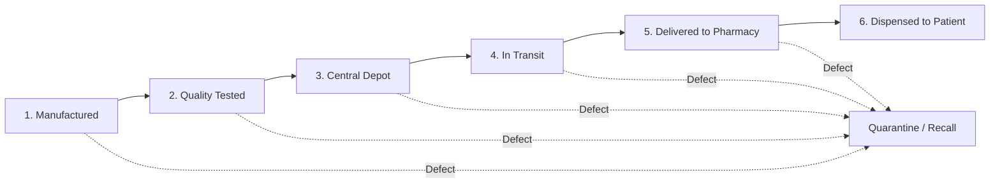
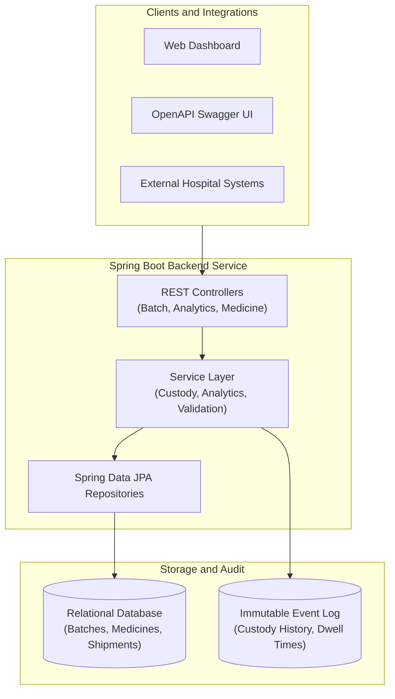
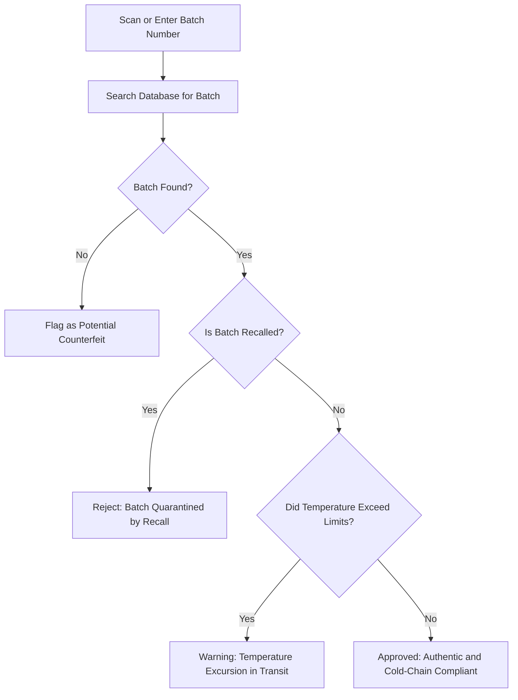
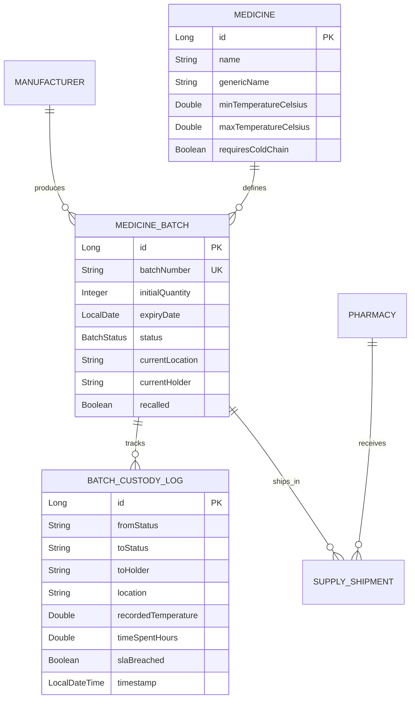

# MediMate - Pharmaceutical Supply Chain and Custody Verification System

[](https://www.oracle.com/java/)
[](https://spring.io/projects/spring-boot)
[](https://hibernate.org/)
[-yellow.svg)](https://www.h2database.com/)
[](http://localhost:8080/swagger-ui.html)


MediMate is an enterprise pharmaceutical supply chain tracking and audit service built with Java 11 and Spring Boot. It monitors drug batches from manufacturing through hospital delivery, validates custody transfers, tracks cold-chain storage temperatures, and detects distribution delays using process mining principles.

---

## Overview

In pharmaceutical distribution, medicines must be tracked accurately to prevent counterfeit drugs from entering pharmacies, prevent temperature-sensitive biologics (like insulin or vaccines) from spoiling, and ensure defective batches can be recalled quickly.

MediMate provides:
- A validated custody handover workflow for each drug batch.
- Temperature monitoring to detect cold-chain violations during transit.
- Anti-counterfeit verification to confirm genuine provenance.
- Process event logging to analyze transit times and operational bottlenecks.

---

## Core Supply Chain Workflow

Every medicine batch moves through five main stages before reaching the patient. If a safety defect is discovered, the batch can be quarantined immediately at any point.



### Stage Explanations
1. **Manufactured**: The licensed pharmaceutical plant formulates and packages the batch.
2. **Quality Tested**: Laboratory testing verifies chemical purity and sterility before release.
3. **Central Depot**: The batch is stored in regional warehouses under controlled conditions.
4. **In Transit**: Refrigerated vehicles transport the batch; temperature dataloggers monitor conditions.
5. **Delivered to Pharmacy**: The hospital or retail pharmacy receives and inspects the shipment.
6. **Dispensed**: The medication is safely prescribed and dispensed to the patient.
7. **Quarantine / Recall**: Emergency hold triggered if safety defects or temperature violations occur.

---

## System Architecture

The application uses a standard three-tier architecture:



---

## Anti-Counterfeit Verification Flow

When a pharmacist receives a medication batch, they query MediMate to verify its authenticity and safety before dispensing:



---

## Process Mining and Bottleneck Analysis

MediMate applies process mining concepts to help operations teams detect delays in the distribution pipeline.

### Event Log Structure
Each time custody of a batch changes, an immutable event record is created:
- **Case ID**: The batch number (for example, `MED-2026-PF01`).
- **Activity**: The stage change (for example, `IN_TRANSIT` to `DELIVERED_TO_PHARMACY`).
- **Timestamp**: The exact date and time of the handover.
- **Resource**: The custodian or carrier accepting responsibility.
- **Metrics**: Recorded temperature and dwell time in hours.

### Bottleneck Identification
By analyzing historical event logs across all batches, the analytics service automatically calculates:
- Average and maximum dwell hours spent at each stage.
- Service Level Agreement (SLA) breach rates per carrier or warehouse.
- Stalled shipments currently overdue for delivery.

---

## Application Interfaces

MediMate includes three built-in interfaces accessible when running locally:

| Interface | URL | Description |
| :--- | :--- | :--- |
| **Web Dashboard** | `http://localhost:8080/` | Interactive management dashboard with stage pipeline, batch verifier, and telemetry tables. |
| **OpenAPI / Swagger** | `http://localhost:8080/swagger-ui.html` | Interactive API documentation to inspect and test all REST endpoints. |
| **H2 Console** | `http://localhost:8080/h2-console` | Database management console to view relational tables (`jdbc:h2:mem:medimatedb`, user: `sa`). |

---

## REST API Reference

### Batch Custody and Verification
| Method | Endpoint | Description |
| :--- | :--- | :--- |
| `POST` | `/api/batches` | Register a new medicine production batch |
| `GET` | `/api/batches` | List batches with optional status and active filters |
| `GET` | `/api/batches/{id}` | Retrieve specific batch details by database ID |
| `POST` | `/api/batches/{id}/transfer` | Advance custody to the next stage with temperature logging |
| `POST` | `/api/batches/{id}/recall` | Trigger an emergency regulatory recall and quarantine |
| `GET` | `/api/batches/{batchNumber}/verify` | Verify batch authenticity and inspect the complete custody chain |

### Process Analytics
| Method | Endpoint | Description |
| :--- | :--- | :--- |
| `GET` | `/api/analytics/stalled-shipments` | List active shipments currently exceeding transit SLAs |
| `GET` | `/api/analytics/latency` | View average stage duration and SLA breach rates |
| `GET` | `/api/analytics/expiring-batches` | List batches approaching their expiration date |
| `GET` | `/api/analytics/dashboard` | Executive KPI health summary of the supply chain |

### Medicine and Partner Catalog
| Method | Endpoint | Description |
| :--- | :--- | :--- |
| `GET` | `/api/medicines` | List catalog medicines with cold-chain specifications |
| `POST` | `/api/medicines` | Register a new drug with required temperature thresholds |
| `GET` | `/api/manufacturers` | List licensed pharmaceutical manufacturers |
| `GET` | `/api/pharmacies` | List registered hospital and retail pharmacies |

---

## Relational Data Model



---

## Automated Testing

The project includes unit and integration tests covering the state machine logic, custody handovers, cold-chain checks, and recall handling.

Run tests using the Maven wrapper:
```bash
./mvnw clean test
```

### Test Results
```text
Running com.medimate.MedimateApplicationTests
Tests run: 1, Failures: 0, Errors: 0, Skipped: 0

Running com.medimate.BatchStatusTest
Tests run: 4, Failures: 0, Errors: 0, Skipped: 0

Running com.medimate.MediMateServiceIntegrationTest
Tests run: 6, Failures: 0, Errors: 0, Skipped: 0

BUILD SUCCESS (Total: 11 tests passed, 0 failures)
```

---

## Quickstart and Local Setup

### Prerequisites
- Java 11 LTS or higher
- Git

### 1. Clone the Repository
```bash
git clone https://github.com/aanshiomar31-oss/medimate.git
cd medimate
```

### 2. Run the Application
```bash
./mvnw spring-boot:run
```

Once started, the service is available at `http://localhost:8080/`.

---

