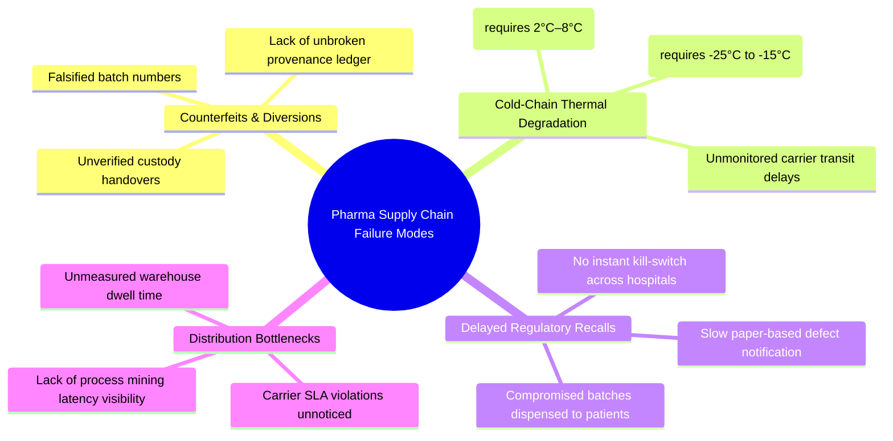
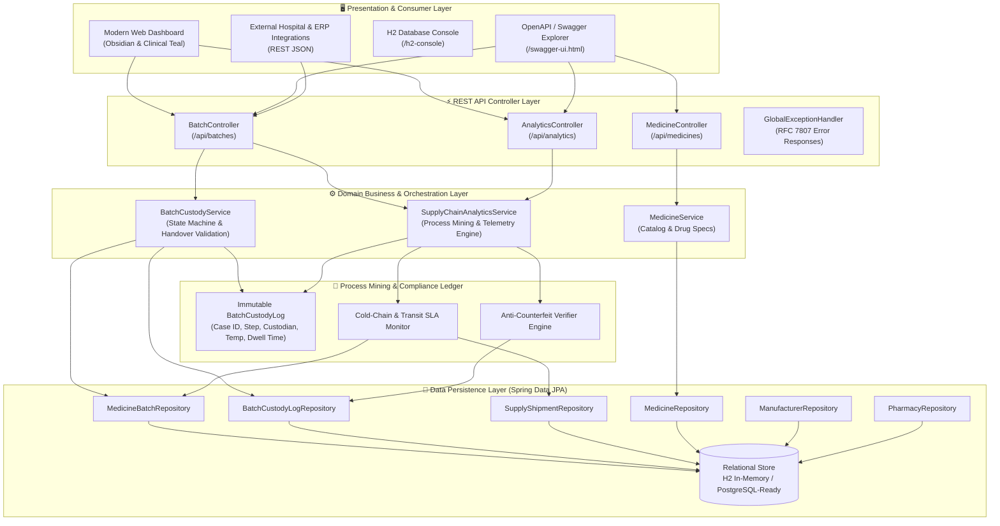
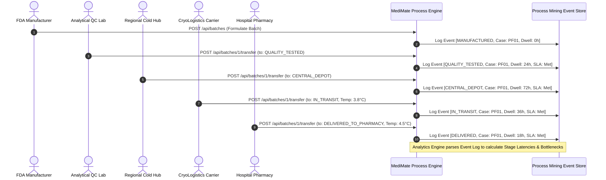
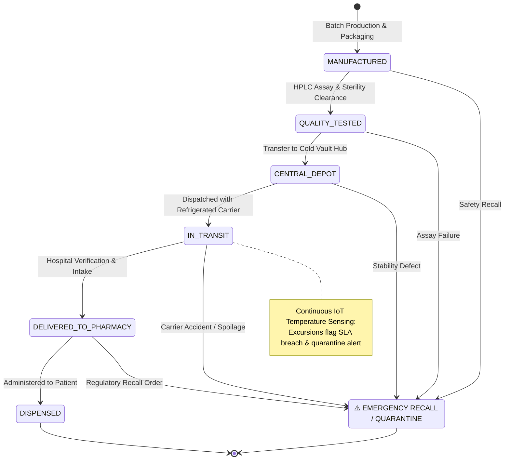
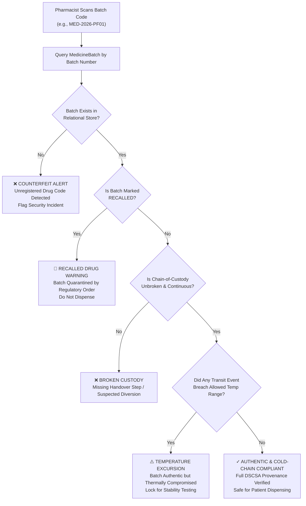
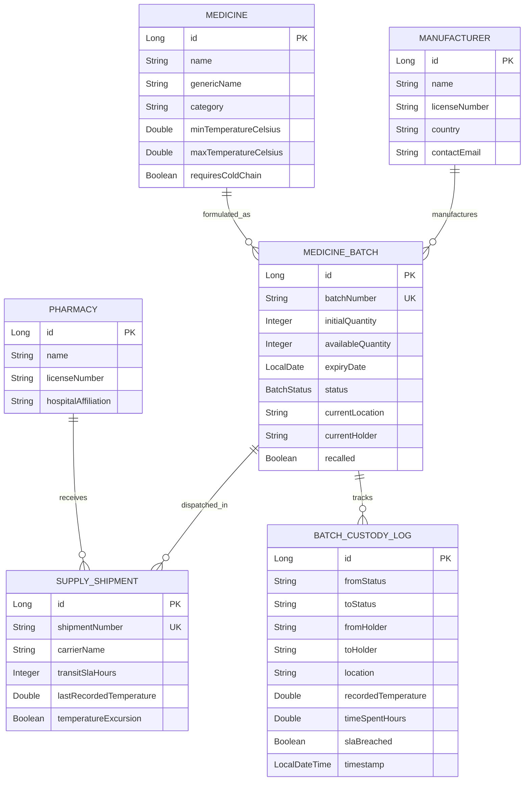

# 💊 MediMate — Autonomous Pharmaceutical Custody & Process Mining Engine

[](https://www.oracle.com/java/)
[](https://spring.io/projects/spring-boot)
[](https://hibernate.org/)
[-yellow.svg)](https://www.h2database.com/)
[](http://localhost:8080/swagger-ui.html)
[](https://www.fda.gov/drugs/drug-supply-chain-security-act-dscsa)
[](LICENSE)

> **MediMate** is an enterprise-grade pharmaceutical supply chain backend and real-time execution engine. Engineered with **Java 11, Spring Boot, Hibernate/JPA, and Process Mining event architecture**, it orchestrates drug batch custody handovers, monitors IoT cold-chain temperature telemetry, verifies anti-counterfeit batch provenance, and discovers distribution bottlenecks across hospital and pharmaceutical networks.

---

## 📌 Table of Contents
1. [The Real-World Problem](#-the-real-world-problem)
2. [System Architecture & Topology](#-system-architecture--topology)
3. [Process Mining & Celonis Alignment](#-process-mining--celonis-alignment)
4. [Pharmaceutical State Machine Workflow](#-pharmaceutical-state-machine-workflow)
5. [Anti-Counterfeit Provenance Verification Flow](#-anti-counterfeit-provenance-verification-flow)
6. [Cold-Chain IoT Telemetry & Excursion Flow](#-cold-chain-iot-telemetry--excursion-flow)
7. [Interactive Enterprise Dashboard](#-interactive-enterprise-dashboard)
8. [Complete REST API Reference](#-complete-rest-api-reference)
9. [Relational Data Model](#-relational-data-model)
10. [Automated Testing & Verification](#-automated-testing--verification)
11. [Quickstart & Local Setup](#-quickstart--local-setup)
12. [Resume / CV Talking Points](#-resume--cv-talking-points)

---

## 🎯 The Real-World Problem

Pharmaceutical supply chains handle life-critical biologics, vaccines, and prescription medications. The World Health Organization (WHO) estimates that counterfeit and degraded medicines cause over **1,000,000 preventable deaths annually** and account for **$30+ billion in economic losses**.



**MediMate** addresses each failure mode through automated state machine validation, real-time IoT temperature monitoring, immutable event auditing, and instant cryptographic provenance verification.

---

## 🏛️ System Architecture & Topology

The platform follows a layered, domain-driven enterprise architecture ensuring transactional isolation, clean data boundaries, and sub-second query performance:



---

## 📈 Process Mining & Celonis Alignment

This project is architected around the core data paradigms of **Process Mining** (the core technology powering **Celonis**):

### The Process Mining Triad in MediMate:
Every custody handover generates an immutable [`BatchCustodyLog`](src/main/java/com/medimate/model/BatchCustodyLog.java) event containing:
1. **Case ID**: The unique batch tracking code (`batchNumber`, e.g., `MED-2026-PF01`).
2. **Activity / State Transition**: The exact lifecycle transition (`fromStatus` $\rightarrow$ `toStatus`).
3. **Timestamp**: High-precision UTC timestamp recording when custody was accepted.
4. **Context Attributes**: `fromHolder`, `toHolder`, `location`, `recordedTemperature`, `timeSpentHours`, and `slaBreached`.



---

## ⚙️ Pharmaceutical State Machine Workflow

Every batch must traverse an unbroken custody sequence. Any attempt to jump stages (e.g. shipping uninspected medicine directly from manufacturing to a hospital) is rejected by the business validation rules:



---

## 🛡️ Anti-Counterfeit Provenance Verification Flow

When a receiving hospital pharmacist inspects a batch, the **Provenance Verifier** inspects the full historical chain:



---

## ❄️ Cold-Chain IoT Telemetry & Excursion Flow

```mermaid
flowchart LR
    Sensor["IoT Datalogger / GPS Tracker\n(CryoTrans Fleet)"] -->|Telemetry Payload| Endpoint["REST: GET /api/analytics/stalled-shipments"]
    Endpoint --> Compare{"Recorded Temp vs\nDrug Tolerance"}
    
    Compare -->|Within Range (e.g. 2°C - 8°C)| Normal["✓ Status: Compliant"]
    Compare -->|Exceeds Max (e.g. -12°C > -15°C)| ExcursionAlert["⚠️ Excursion Alert\nFlag Batch as Non-Compliant"]
    
    Endpoint --> TransitSLA{"Transit Duration vs\nSLA Target"}
    TransitSLA -->|Overdue (e.g. 38h > 24h SLA)| StalledAlert["🚨 CRITICAL BOTTLENECK\nCarrier Overdue +14 Hours"]
```

---

## 🖥️ Interactive Enterprise Dashboard

MediMate includes a fully integrated, responsive dark-mode web application running out of the box at **`http://localhost:8080/`**:

| Dashboard Feature | Capability |
| :--- | :--- |
| **Autonomous 7-Stage Tracker** | Interactive horizontal process diagram; click any stage to filter active inventory in real time. |
| **Executive Holographic KPIs** | Visual cards tracking Active Batches, Transit Compliance %, Stalled Shipments, and Expiring Batches. |
| **Anti-Counterfeit Verifier** | Instant provenance auditor with 1-click sample buttons (`PF01`, `CV02`, `AG03`, `LP04`) and cryptographic timeline. |
| **Cold-Chain Telemetry Table** | Instant-search table with allowable temperature thresholds, storage locations, and custodians. |
| **Process Mining Latency Radar** | Celonis-style dwell-time breakdown across stages to identify supply chain bottlenecks. |
| **Custody Handover Controls** | Form to execute state-machine-validated transfers with temperature datalogger logging. |
| **Emergency Recall Action** | Official FDA/CDSCO Class I/II regulatory quarantine trigger to freeze compromised batches. |

---

## 📡 Complete REST API Reference

### 1. Batch Custody & Provenance
| Method | Endpoint | Description | Status Code |
| :--- | :--- | :--- | :--- |
| `POST` | `/api/batches` | Register a new pharmaceutical production batch | `201 Created` |
| `GET` | `/api/batches` | List batches (Filters: `status`, `activeOnly`) | `200 OK` |
| `GET` | `/api/batches/{id}` | Retrieve specific batch details by ID | `200 OK` |
| `POST` | `/api/batches/{id}/transfer` | Execute state-validated custody handover | `200 OK` |
| `POST` | `/api/batches/{id}/recall` | Trigger emergency regulatory recall & quarantine | `200 OK` |
| `GET` | `/api/batches/{batchNumber}/verify` | Anti-counterfeit verification of unbroken provenance | `200 OK` |

### 2. Supply Chain Process Analytics (Celonis Features)
| Method | Endpoint | Description | Status Code |
| :--- | :--- | :--- | :--- |
| `GET` | `/api/analytics/stalled-shipments` | Detect shipments exceeding SLA or breaching temp limits | `200 OK` |
| `GET` | `/api/analytics/latency` | Process mining stage latency & dwell time analytics | `200 OK` |
| `GET` | `/api/analytics/expiring-batches` | Batches nearing expiration cutoff (Default: 60 days) | `200 OK` |
| `GET` | `/api/analytics/dashboard` | Executive KPI health summary of the supply chain | `200 OK` |

### 3. Pharmaceutical Registry
| Method | Endpoint | Description | Status Code |
| :--- | :--- | :--- | :--- |
| `GET` | `/api/medicines` | List catalog drugs (Filter: `requiresColdChain`) | `200 OK` |
| `POST` | `/api/medicines` | Register new pharmaceutical drug & temperature specs | `201 Created` |
| `GET` | `/api/manufacturers` | List licensed pharmaceutical producers (FDA/GMP) | `200 OK` |
| `GET` | `/api/pharmacies` | List registered hospital & retail pharmacies | `200 OK` |

---

## 🗄️ Relational Data Model



---

## 🧪 Automated Testing & Verification

MediMate includes comprehensive integration and unit tests covering:
* **State Machine Validation**: Rejection of invalid stage transitions, jump skips, and unauthorized actions on recalled batches.
* **Cold-Chain SLA Engine**: Detection of temperature spikes and dwell-time calculation.
* **Provenance Verification**: Validating authentic batches and flagging compromised/recalled batches.

Run tests using the Maven wrapper:
```bash
./mvnw clean test
```

### Test Suite Execution Output:
```text
[INFO] Running com.medimate.MedimateApplicationTests
[INFO] Tests run: 1, Failures: 0, Errors: 0, Skipped: 0
[INFO] Running com.medimate.BatchStatusTest
[INFO] Tests run: 4, Failures: 0, Errors: 0, Skipped: 0
[INFO] Running com.medimate.MediMateServiceIntegrationTest
[INFO] Tests run: 6, Failures: 0, Errors: 0, Skipped: 0
[INFO] ------------------------------------------------------------------------
[INFO] BUILD SUCCESS (11 Tests Run, 0 Failures, 0 Errors)
[INFO] ------------------------------------------------------------------------
```

---

## 🚦 Quickstart & Local Setup

### Prerequisites
* **Java 11 LTS** or higher (Amazon Corretto, OpenJDK, Temurin)
* **Git**

### 1. Clone the Repository
```bash
git clone https://github.com/aanshiomar31-oss/medimate.git
cd medimate
```

### 2. Run the Application
```bash
./mvnw spring-boot:run
```

### 3. Access Live Interfaces
Once the server starts on port `8080`:
* 🌐 **Web Dashboard**: [http://localhost:8080/](http://localhost:8080/)
* 📑 **Interactive Swagger UI**: [http://localhost:8080/swagger-ui.html](http://localhost:8080/swagger-ui.html)
* 🗄️ **H2 Database Console**: [http://localhost:8080/h2-console](http://localhost:8080/h2-console)
  * *JDBC URL*: `jdbc:h2:mem:medimatedb`
  * *User*: `sa`
  * *Password*: *(leave empty)*

---

## 💼 Resume / CV Talking Points

You can feature this project on your CV for **Celonis**, **enterprise backend**, and **health-tech software engineering** roles:

> **MediMate — Enterprise Medicine Supply Chain & Custody Engine** | *Java 11, Spring Boot 2.7, Hibernate/JPA, REST APIs, OpenAPI/Swagger*  
> *GitHub: [github.com/aanshiomar31-oss/medimate](https://github.com/aanshiomar31-oss/medimate)*
> - Engineered an enterprise pharmaceutical supply chain platform with a strict 7-stage state machine (`MANUFACTURED` to `DISPENSED`) enforcing custody validation and preventing uninspected drug releases.
> - Implemented an **Anti-Counterfeit Provenance Verification Engine** that validates unbroken custody continuity from FDA-licensed manufacturers to hospital pharmacies with instant authenticity auditing.
> - Built a real-time **Cold-Chain & Transit SLA Monitor** alerting on temperature excursions and shipping bottlenecks to prevent vaccine and biologic spoilage.
> - Designed **Process Mining event logs** tracking stage transition latencies, bottleneck percentages, and SLA violations to optimize pharma distribution throughput.
> - Built a responsive **real-time management dashboard** directly integrated with Spring Boot REST endpoints, featuring batch search, custody timeline inspection, and emergency regulatory recall actions.

---

## 📄 License
This project is open-source and available under the [Apache 2.0 License](LICENSE).
